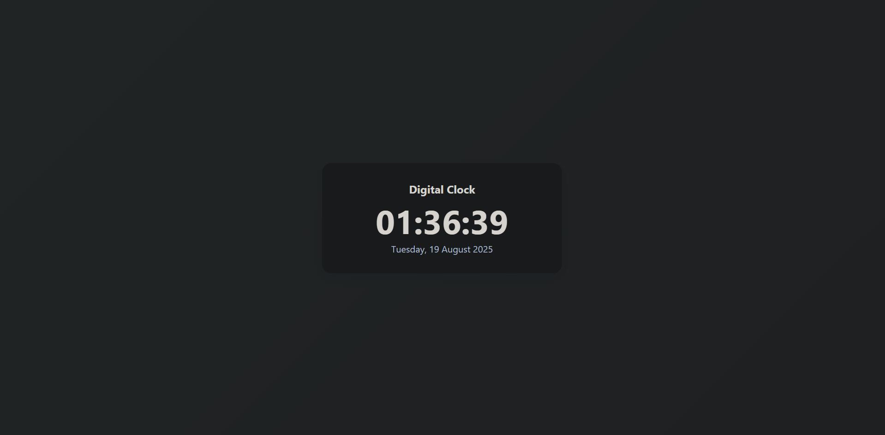

# ⏰ Digital Clock | Relógio Digital

A simple **Digital Clock** built with **HTML, CSS, and JavaScript**.  
The project displays the current time and date in real-time, updating every second.

Um simples **Relógio Digital** feito com **HTML, CSS e JavaScript**.  
O projeto mostra a hora e a data em tempo real, atualizando a cada segundo.

🔗 **Live Demo / Demo Online:** [View on GitHub Pages](https://giulyachristinabarbosa-max.github.io/digital-clock/)

---

## 📸 Preview | Prévia

---

## 🛠️ Technologies Used | Tecnologias Utilizadas
- **HTML5** → page structure / estrutura da página  
- **CSS3** → styling and responsive layout / estilo e layout responsivo  
- **JavaScript (ES6+)** → logic to display and update time/date / lógica para exibir e atualizar hora/data  

---

## 🚀 Features | Funcionalidades
- Shows the current time in **HH:MM:SS** format  
- Updates every second using `setInterval`  
- Displays the current **day, date, month, and year**  
- Responsive design for desktop and mobile  

---
- Mostra a hora atual no formato **HH:MM:SS**  
- Atualiza a cada segundo usando `setInterval`  
- Exibe o **dia da semana, data, mês e ano**  
- Design responsivo para desktop e celular  

---

## 📂 Project Structure | Estrutura do Projeto
